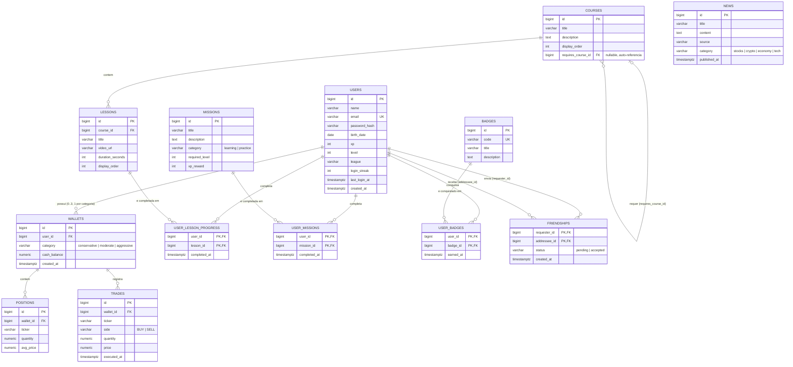

# Diagrama Entidade-Relacionamento

Modelo completo do backend, derivado do schema em `SPEC.md` §4. Este arquivo é a referência visual; o `SPEC.md` continua sendo a fonte de verdade para tipos exatos e DDL. Renderiza nativo no GitHub; no VS Code precisa da extensão "Markdown Preview Mermaid Support".

## Lendo o diagrama

- `||--o{` = um-para-muitos obrigatório do lado "um" (ex.: um usuário pode ter zero ou várias carteiras, mas toda carteira pertence a exatamente um usuário).
- `|o--o{` = um-para-muitos opcional dos dois lados (usado só em `COURSES` auto-referenciando `COURSES`, porque `requires_course_id` pode ser nulo — nem todo curso exige um anterior).
- `PK, FK` nas tabelas de junção (`USER_LESSON_PROGRESS`, `USER_MISSIONS`, `USER_BADGES`, `FRIENDSHIPS`) significa **chave primária composta**: os dois campos juntos formam o `PRIMARY KEY`, e cada um também é `FOREIGN KEY` para sua tabela de origem. É assim que se modela relação muitos-para-muitos em SQL — não existe `@ManyToMany` direto entre `USERS` e `LESSONS`, existe uma tabela no meio.

## Três padrões de relacionamento que você vai implementar em JPA

1. **Um-para-muitos simples** (`USERS` → `WALLETS`, `WALLETS` → `POSITIONS`/`TRADES`, `COURSES` → `LESSONS`): no lado "muitos", um campo `@ManyToOne` apontando pro pai. Normalmente não precisa do `@OneToMany` inverso a menos que você realmente precise navegar do pai pros filhos em memória — evite adicionar isso "por via das dúvidas", é fonte comum de N+1 query.
2. **Muitos-para-muitos via tabela de junção com atributo próprio** (`USER_LESSON_PROGRESS`, `USER_MISSIONS`, `USER_BADGES`): como cada linha tem um `completed_at`/`earned_at`, isso não é um `@ManyToMany` puro do JPA (que não suporta bem atributos extras na tabela de junção) — vira uma **entidade própria** com chave composta (`@EmbeddedId` ou `@IdClass`), com dois `@ManyToOne`. Você vai sentir essa diferença na prática na Fase 5.
3. **Auto-relacionamento opcional** (`COURSES.requires_course_id`): um `@ManyToOne` de `Course` para `Course` mesmo, campo anulável. É o mecanismo por trás do bloqueio de módulos (RF14).
4. **Duas FKs para a mesma tabela** (`FRIENDSHIPS.requester_id` e `.addressee_id`, ambas para `USERS`): também chave composta, mas com dois `@ManyToOne` diferentes apontando para a mesma entidade `User` — o JPA não confunde os dois desde que cada `@JoinColumn` tenha o nome certo.

## O que o diagrama não mostra

Regras de negócio não são estrutura de FK, então não aparecem aqui — estão em `SPEC.md` §6: uma carteira por categoria por usuário (`UNIQUE(user_id, category)`), saldo nunca negativo, XP/nível só mudam como efeito colateral de ação validada no servidor. O diagrama garante que os dados *podem* se relacionar dessa forma; as regras garantem que eles relacionam *corretamente*.
